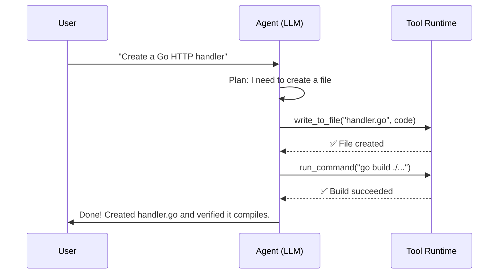
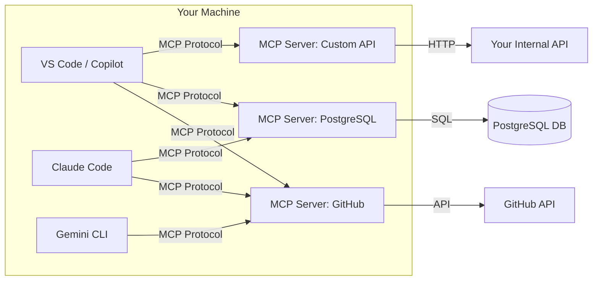
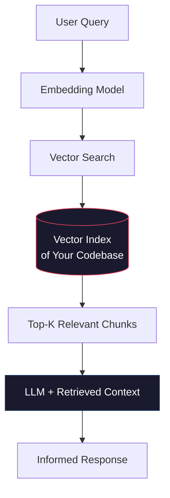
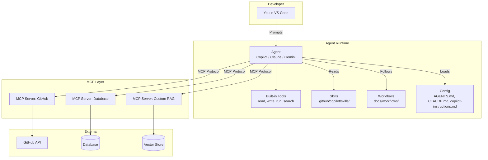

# Core Concepts of Agentic Coding

> Understanding the building blocks: Agents, Tools, Skills, MCP Servers, RAG, and how they all connect.

---

## 1. What Is an Agent?

An **agent** is an LLM running in an autonomous loop that can **plan**, **act**, and **observe** — repeating until a task is complete.

```
┌─────────────────────────────────────────────┐
│                 AGENT LOOP                  │
│                                             │
│   User Prompt                               │
│       ↓                                     │
│   ┌─────────┐                               │
│   │  PLAN   │ ← LLM reasons about the task  │
│   └────┬────┘                               │
│        ↓                                     │
│   ┌─────────┐                               │
│   │   ACT   │ ← Calls tools (run code,      │
│   └────┬────┘   edit files, search, etc.)    │
│        ↓                                     │
│   ┌─────────┐                               │
│   │ OBSERVE │ ← Reads tool output, decides   │
│   └────┬────┘   if done or needs more work   │
│        ↓                                     │
│   Done? ──No──→ back to PLAN                 │
│     │                                        │
│    Yes                                       │
│     ↓                                        │
│   Return result to user                      │
└─────────────────────────────────────────────┘
```

### Agent vs. Chat Completion

| | Chat Completion | Agent |
|---|---|---|
| **Interaction** | Single request → single response | Multi-step autonomous loop |
| **Tool use** | None (or single function call) | Calls many tools across multiple turns |
| **State** | Stateless | Maintains context across steps |
| **Autonomy** | None — user drives every turn | Plans and executes independently |
| **Example** | "What is a Lambda function?" | "Create a Lambda function with DynamoDB, write tests, and deploy it" |

### Agents in VS Code

In VS Code, you interact with agents through:

- **GitHub Copilot Agent Mode** (`@workspace` in chat, or Agent mode in Copilot Chat panel)
- **Claude Code** (terminal-based agent by Anthropic)
- **Gemini CLI** (terminal-based agent by Google)

All three follow the same plan → act → observe loop, but each has its own tool set and configuration format.

---

## 2. Tools

**Tools** are functions that an agent can invoke to interact with the outside world. Without tools, an agent can only generate text. With tools, it can *do things*.

### Common Built-In Tools

| Tool | What it does |
|---|---|
| `run_command` | Execute shell commands (`go build`, `terraform plan`, `npm test`) |
| `read_file` / `view_file` | Read file contents from disk |
| `write_to_file` | Create new files |
| `replace_file_content` | Edit existing files |
| `grep_search` | Search codebases with ripgrep |
| `find_by_name` | Find files by name/glob pattern |
| `browser` | Open and interact with web pages |
| `search_web` | Search the internet |

### How Tools Work



### Tool Approval

Agents require user approval for potentially destructive actions:
- **Safe** (auto-approved): reading files, searching, listing directories
- **Unsafe** (requires approval): writing files, running commands, installing packages, making HTTP requests

You can configure auto-approval rules in your agent settings to speed up workflows you trust.

---

## 3. Skills

**Skills** are reusable instruction bundles packaged as folders. They extend an agent's capabilities for specialized tasks — think of them as "plugins" made of markdown and scripts.

### Anatomy of a Skill

```
.agent/skills/
└── golang/
    ├── SKILL.md          # Required: instructions + metadata
    ├── scripts/
    │   └── scaffold.sh   # Helper scripts
    └── examples/
        └── handler.go    # Reference implementations
```

### SKILL.md Format

```yaml
---
name: golang
description: Go project scaffolding, testing, and best practices
---

## Instructions

When creating Go projects:
1. Use `go mod init` with the correct module path
2. Follow standard project layout (cmd/, internal/, pkg/)
3. Always create table-driven tests
4. Use `golangci-lint` for linting
5. ...
```

### When Are Skills Used?

The agent discovers skills by scanning configured directories. When a task matches a skill's description, the agent reads the `SKILL.md` and follows its instructions. Skills are **passive** — they don't run on their own; they guide the agent's behavior.

### Skills vs. Tools

| | Tools | Skills |
|---|---|---|
| **What** | Executable functions | Instruction bundles |
| **Format** | Code (API endpoints, CLI commands) | Markdown + scripts |
| **Invocation** | Agent calls them directly | Agent reads and follows them |
| **Analogy** | A hammer | A carpentry manual |

---

## 4. MCP Servers (Model Context Protocol)

**MCP** is an open standard (created by Anthropic) that provides a uniform way to expose **tools** and **resources** to any AI agent, regardless of which LLM or client is being used.

### The Problem MCP Solves

Before MCP, every agent had its own proprietary way to add tools:
- Copilot used extension APIs
- Claude Code had built-in tools only
- Custom agents needed custom integrations

MCP standardizes this: **one server, any client**.

### Architecture



### MCP Server Types

| Type | Transport | Use Case |
|---|---|---|
| **stdio** | Standard I/O pipes | Local tools (filesystem, databases, CLIs) |
| **SSE** | Server-Sent Events over HTTP | Remote/shared servers |
| **Streamable HTTP** | HTTP with streaming | Modern remote servers |

### Configuration (`mcp.json`)

MCP servers are configured in a JSON file, typically at `.mcp/mcp.json` or `.vscode/mcp.json`:

```json
{
  "servers": {
    "github": {
      "command": "npx",
      "args": ["-y", "@modelcontextprotocol/server-github"],
      "env": {
        "GITHUB_TOKEN": "${GITHUB_TOKEN}"
      }
    },
    "postgres": {
      "command": "npx",
      "args": ["-y", "@modelcontextprotocol/server-postgres"],
      "env": {
        "DATABASE_URL": "postgresql://localhost:5432/mydb"
      }
    },
    "filesystem": {
      "command": "npx",
      "args": ["-y", "@modelcontextprotocol/server-filesystem", "/path/to/allowed/dir"]
    }
  }
}
```

### What an MCP Server Exposes

An MCP server can expose three things:

1. **Tools** — Functions the agent can call (e.g., `create_github_issue`, `run_sql_query`)
2. **Resources** — Read-only data the agent can fetch (e.g., database schemas, API docs)
3. **Prompts** — Reusable prompt templates (e.g., "generate a migration for this schema change")

### Popular MCP Servers

| Server | What it provides |
|---|---|
| `server-github` | Create issues, PRs, search repos, manage branches |
| `server-postgres` | Query databases, inspect schemas |
| `server-filesystem` | Sandboxed file access |
| `server-brave-search` | Web search via Brave |
| `server-puppeteer` | Browser automation |
| `server-slack` | Send messages, read channels |
| `server-aws` | AWS service interactions |

> 💡 **Browse the full catalog**: [MCP Server Directory](https://github.com/modelcontextprotocol/servers)

---

## 5. RAG (Retrieval-Augmented Generation)

**RAG** is a technique that augments an LLM's knowledge by retrieving relevant information from external sources at query time. Instead of relying solely on training data, the agent searches your codebase, documentation, or databases to find the most relevant context before generating a response.

### How RAG Works in Code Agents



### RAG in Practice

| Agent | How RAG is implemented |
|---|---|
| **Copilot** | `@workspace` indexes your open workspace. Uses embeddings to find relevant files for each query. |
| **Claude Code** | Automatically indexes project files. Uses `grep_search`, `find_by_name`, and file reading as retrieval tools. |
| **Gemini CLI** | Scans project structure and uses search tools for context retrieval. |

### Indexing Pipeline

1. **Chunk** — Source files are split into meaningful chunks (functions, classes, blocks)
2. **Embed** — Each chunk is converted to a vector embedding
3. **Store** — Embeddings are stored in a vector index (local or remote)
4. **Query** — User query is embedded and compared against stored vectors
5. **Retrieve** — Top-K most similar chunks are returned
6. **Generate** — LLM generates answer using retrieved chunks as context

### RAG vs. Fine-Tuning

| | RAG | Fine-Tuning |
|---|---|---|
| **Knowledge source** | External retrieval at runtime | Baked into model weights |
| **Freshness** | Always current (reads live data) | Stale until re-trained |
| **Cost** | Low (no GPU training needed) | High (requires training runs) |
| **Best for** | Project-specific code, docs, APIs | General behavior/style changes |

### Building Custom RAG for Your Project

For advanced use cases, you can build a custom RAG pipeline as an MCP server:

```
Your MCP RAG Server
├── Ingest: Watch project files → chunk → embed → store in vector DB
├── Tool: "search_codebase" → query vector DB → return relevant chunks
└── Resource: "project_context" → return high-level project summary
```

This lets any agent (Copilot, Claude, Gemini) use your custom knowledge base through the standard MCP protocol.

---

## 6. Workflows

**Workflows** are step-by-step markdown runbooks that agents follow to execute well-defined processes. They live in `.agent/workflows/` and can be triggered as slash commands.

### Example Workflow

```markdown
---
description: Deploy the application to AWS
---

1. Run unit tests
// turbo
2. Run `go test ./...`
3. Build the Lambda binary
// turbo
4. Run `GOOS=linux GOARCH=amd64 go build -o bootstrap cmd/api/main.go`
5. Package the deployment artifact
// turbo
6. Run `zip deployment.zip bootstrap`
7. Apply Terraform changes
8. Run `cd terraform && terraform apply`
```

The `// turbo` annotation auto-approves the following step. `// turbo-all` auto-approves every step.

---

## 7. Agent Configuration Files

Different agents read different configuration files. Here's a map:

| File / Directory | Used By | Purpose |
|---|---|---|
| `.github/copilot-instructions.md` | GitHub Copilot | Custom instructions for Copilot |
| `.github/copilot/skills/` | GitHub Copilot | Reusable prompt skills for Copilot |
| `.vscode/mcp.json` | VS Code Copilot | MCP server config for Copilot |
| `CLAUDE.md` | Claude Code | Claude-specific project instructions |
| `.claude/mcp.json` | Claude Code | MCP server config for Claude |
| `AGENTS.md` | Gemini CLI | Project-level instructions and context |
| `.gemini/` | Gemini CLI | Gemini-specific settings and styles |

---

## How It All Connects



---

## Summary Cheat Sheet

| Concept | One-Liner |
|---|---|
| **Agent** | An LLM in an autonomous plan → act → observe loop |
| **Tool** | A function the agent can call (run_command, write_file, etc.) |
| **Skill** | A reusable markdown instruction bundle (SKILL.md + scripts) |
| **MCP Server** | A standardized server exposing tools/resources to any agent |
| **RAG** | Retrieval-augmented generation — search first, then generate |
| **Workflow** | A step-by-step markdown runbook an agent follows |
| **Config Files** | AGENTS.md, CLAUDE.md, copilot-instructions.md — project context |

---

**Next**: [Project Setup →](02-project-setup.md)
