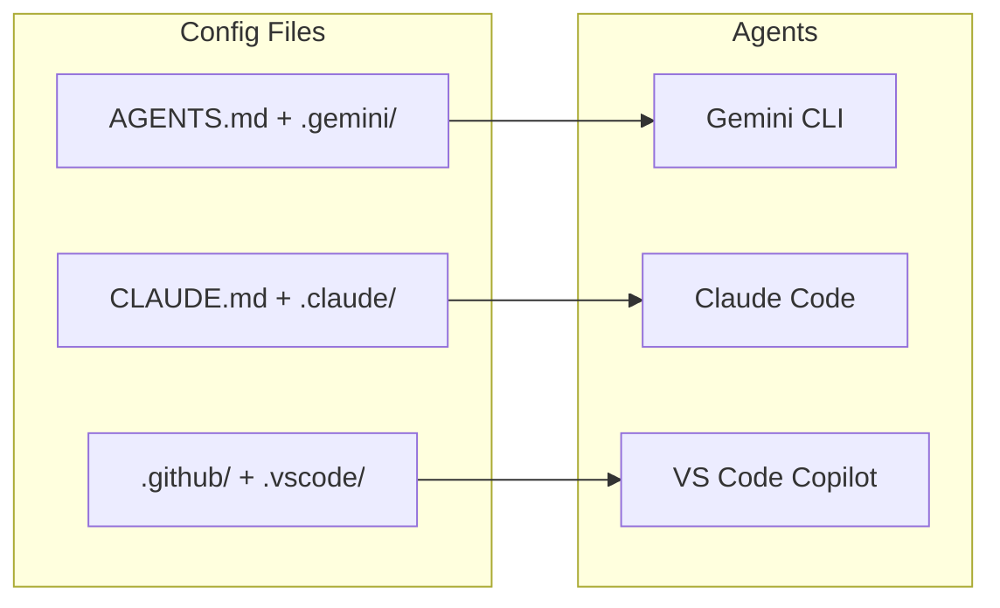

# Project Setup Guide

> Configure your environment for agentic coding with VS Code, Copilot, Claude Code, and MCP servers.

---

## 1. VS Code + GitHub Copilot Agent Mode

### Prerequisites

- **VS Code** 1.99+ (Insiders recommended for latest agent features)
- **GitHub Copilot** extension (requires Copilot subscription)
- **GitHub Copilot Chat** extension

### Enable Agent Mode

1. Open VS Code Settings (`Cmd+,`)
2. Search for `chat.agent.enabled`
3. Set to `true`
4. In Copilot Chat panel, switch from "Ask" / "Edit" to **"Agent"** mode

### Custom Instructions for Copilot

Create `.github/copilot-instructions.md` in your project root:

```markdown
# Project Instructions

## Tech Stack
- Language: Go 1.22+
- Infrastructure: AWS (Lambda, API Gateway, DynamoDB)
- IaC: Terraform 1.7+
- Testing: Go standard testing + testify

## Coding Standards
- Follow Go standard project layout (cmd/, internal/, pkg/)
- Use table-driven tests
- All exported functions must have doc comments
- Use structured logging with slog

## Architecture
- Serverless microservices on AWS
- REST APIs via API Gateway
- DynamoDB for persistence
```

### VS Code MCP Configuration

Create `.vscode/mcp.json`:

```json
{
  "servers": {
    "github": {
      "command": "npx",
      "args": ["-y", "@modelcontextprotocol/server-github"],
      "env": {
        "GITHUB_TOKEN": "${GITHUB_TOKEN}"
      }
    }
  }
}
```

VS Code will auto-discover and start MCP servers defined here.

---

## 2. Claude Code Setup

### Install

```bash
# Install Claude Code CLI
npm install -g @anthropic-ai/claude-code
```

### Project Configuration

Create `CLAUDE.md` in your project root:

```markdown
# Project Context

This is a URL Shortener service built with Go, deployed to AWS using Terraform.

## Commands
- Build: `go build ./cmd/api/...`
- Test: `go test ./...`
- Lint: `golangci-lint run`
- Deploy: `cd terraform && terraform apply`

## Architecture
- API Gateway → Lambda → DynamoDB
- Go 1.22+ with standard library HTTP handling

## Rules
- Always write tests alongside implementation code
- Use structured logging
- Follow 12-factor app principles
```

### Running Claude Code

```bash
# Start interactive session
claude

# Start with a specific task
claude "create a DynamoDB table for URL mappings"

# Resume previous conversation
claude --resume
```

---

## 3. Gemini CLI Setup

### Install

```bash
# Install Gemini CLI
npm install -g @anthropic-ai/gemini-cli
```

### Project Configuration

Create `AGENTS.md` in your project root:

```markdown
# Project: URL Shortener

## Overview
A serverless URL shortener service on AWS.

## Tech Stack
- Go 1.22+
- AWS Lambda, API Gateway, DynamoDB
- Terraform for infrastructure

## Conventions
- Standard Go project layout
- Table-driven tests
- Terraform modules in terraform/ directory
```

---

## 4. Directory Structure Convention

Each agent has its **own** directory. There is no universal `.agent/` folder — you need to use the right path for the right agent:

```
your-project/
│
│  ┌─── GitHub Copilot ─────────────────────────────────────┐
├── .github/
│   ├── copilot-instructions.md      # Custom instructions
│   └── copilot/                     # Copilot-specific extensions
│       └── skills/                  # Reusable prompt skills
│           └── golang.md
├── .vscode/
│   ├── mcp.json                     # MCP servers for Copilot
│   └── settings.json
│  └────────────────────────────────────────────────────────┘
│
│  ┌─── Claude Code ────────────────────────────────────────┐
├── CLAUDE.md                        # Project instructions
├── .claude/
│   └── mcp.json                     # MCP servers for Claude
│  └────────────────────────────────────────────────────────┘
│
│  ┌─── Gemini CLI ─────────────────────────────────────────┐
├── AGENTS.md                        # Project instructions
├── .gemini/
│   └── settings.json                # Gemini settings
│  └────────────────────────────────────────────────────────┘
│
│  ┌─── Your Project ───────────────────────────────────────┐
├── specs/                           # Spec-driven source of truth
├── cmd/                             # Application entry points
├── internal/                        # Private packages
├── terraform/                       # Infrastructure as Code
├── docs/                            # Documentation
└── README.md
│  └────────────────────────────────────────────────────────┘
```

### Agent Directory Cheat Sheet

| What | Copilot | Claude Code | Gemini CLI |
|---|---|---|---|
| **Instructions** | `.github/copilot-instructions.md` | `CLAUDE.md` | `AGENTS.md` |
| **MCP config** | `.vscode/mcp.json` | `.claude/mcp.json` | `.gemini/settings.json` |
| **Skills/prompts** | `.github/copilot/skills/` | Referenced in `CLAUDE.md` | Referenced in `AGENTS.md` |
| **Reads from** | `.github/` + `.vscode/` | `CLAUDE.md` + `.claude/` | `AGENTS.md` + `.gemini/` |

### Why Multiple Config Files?

Each agent reads **only its own files**. By maintaining configs for all agents, your project works seamlessly with any of them:



> **Tip**: Keep instructions DRY — put shared context in a `specs/` directory that all agents can read as regular files. Put agent-specific behavior in each agent's config.

---

## 5. MCP Server Configuration

### Shared Config (`.mcp/mcp.json`)

```json
{
  "servers": {
    "github": {
      "command": "npx",
      "args": ["-y", "@modelcontextprotocol/server-github"],
      "env": {
        "GITHUB_TOKEN": "${GITHUB_TOKEN}"
      }
    },
    "filesystem": {
      "command": "npx",
      "args": ["-y", "@modelcontextprotocol/server-filesystem", "."]
    },
    "brave-search": {
      "command": "npx",
      "args": ["-y", "@modelcontextprotocol/server-brave-search"],
      "env": {
        "BRAVE_API_KEY": "${BRAVE_API_KEY}"
      }
    }
  }
}
```

### Environment Variables

Store secrets in environment variables, never in config files:

```bash
# ~/.zshrc or ~/.bashrc
export GITHUB_TOKEN="ghp_..."
export BRAVE_API_KEY="BSA..."
```

### Verifying MCP Servers

In VS Code:
1. Open Command Palette (`Cmd+Shift+P`)
2. Run **"MCP: List Servers"**
3. You should see your configured servers with a green status

In Claude Code:
```bash
# List available MCP tools
claude mcp list
```

---

## 6. Skills Setup

Skills work differently depending on the agent:

- **Copilot**: Place skill files in `.github/copilot/skills/` as markdown
- **Claude Code**: Reference skills inline in `CLAUDE.md` or as files the agent can read
- **Gemini**: Reference skills in `AGENTS.md` or as files in `.gemini/`
- **Cross-agent**: Put skills in a `specs/` or `docs/skills/` directory as plain files any agent can read

### Go Skill (Copilot: `.github/copilot/skills/golang.md`)

```yaml
---
name: golang
description: Go project scaffolding, testing, and best practices
---

## Go Project Standards

### Project Layout
- `cmd/` — Main applications
- `internal/` — Private packages (not importable by other projects)
- `pkg/` — Public library code (importable by other projects)

### Testing
- Use table-driven tests
- Use testify for assertions: `github.com/stretchr/testify`
- Aim for 80%+ code coverage

### Error Handling
- Return errors, don't panic
- Wrap errors with context: `fmt.Errorf("parsing config: %w", err)`
- Use custom error types for domain errors
```

### Terraform Skill (Copilot: `.github/copilot/skills/terraform.md`)

```yaml
---
name: terraform
description: Terraform module scaffolding and AWS infrastructure patterns
---

## Terraform Standards

### File Organization
- `main.tf` — Primary resources
- `variables.tf` — Input variables
- `outputs.tf` — Output values
- `providers.tf` — Provider configuration
- `backend.tf` — State backend configuration

### Naming
- Use snake_case for resource names
- Prefix resources with project name
- Use meaningful, descriptive names

### State
- Always use remote state (S3 + DynamoDB locking)
- Never commit .tfstate files
```

---

## 7. Workflow Setup

Workflows are step-by-step runbooks stored as markdown files. Where you put them depends on the agent:

- **Copilot**: Not natively supported — put in `docs/workflows/` and reference from `copilot-instructions.md`
- **Claude Code**: Reference in `CLAUDE.md` or place in project as readable files
- **Gemini/General**: `.gemini/workflows/` or `docs/workflows/`

### Test Workflow (`docs/workflows/test.md`)

```markdown
---
description: Run all tests with coverage
---

1. Run `go test -v -cover ./...`
2. Check coverage threshold
3. Run `go test -race ./...` for race condition detection
```

### Deploy Workflow (`docs/workflows/deploy.md`)

```markdown
---
description: Build and deploy to AWS
---

1. Run tests: `go test ./...`
2. Build Lambda binary: `GOOS=linux GOARCH=amd64 CGO_ENABLED=0 go build -o bootstrap cmd/api/main.go`
3. Package artifact: `zip deployment.zip bootstrap`
4. Review Terraform plan: `cd terraform && terraform plan`
5. Apply Terraform: `cd terraform && terraform apply`
```

---

## Quick Checklist

- [ ] VS Code 1.99+ with Copilot extensions installed
- [ ] Agent Mode enabled in Copilot Chat
- [ ] `.github/copilot-instructions.md` created (Copilot)
- [ ] `.vscode/mcp.json` configured (Copilot MCP)
- [ ] `CLAUDE.md` created (Claude Code)
- [ ] `AGENTS.md` created (Gemini CLI)
- [ ] Skills placed in `.github/copilot/skills/` (Copilot) or referenced in agent instructions
- [ ] Spec files in `specs/` (readable by all agents)
- [ ] Environment variables set for MCP server auth tokens

---

**Previous**: [← Core Concepts](01-core-concepts.md) | **Next**: [Architecture-First Development →](03-architecture-first.md)
