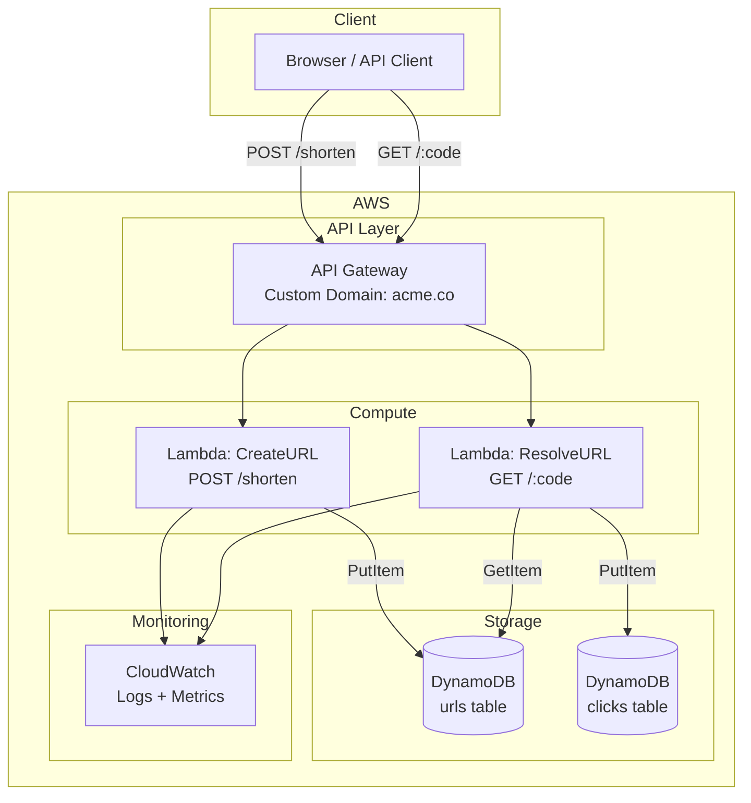

# Architecture-First Development

> Design before you code. Use agents to go from business requirements to architecture to implementation — without writing a single line of code by hand.

---

## The "Zero-Code-First" Methodology

Traditional development starts with code. Agentic development starts with **conversation**.

```
Traditional:          Agentic (Zero-Code-First):

1. Open editor        1. Describe the problem
2. Write code         2. Agent gathers requirements
3. Debug              3. Agent proposes architecture
4. Refactor           4. YOU review and approve
5. Write tests        5. Agent generates everything
6. Write docs         6. Agent tests and validates
7. Deploy             7. Agent deploys
```

The developer's role shifts from **writing code** to **making decisions**.

---

## Phase 1: Requirements Gathering with Agents

### The Prompt Pattern

Start every project with a requirements-gathering conversation. Here's a proven prompt template:

```
I need to build a [type of system]. Here's what I know so far:

**Business Context**: [why this exists, who it serves]
**Key Features**: [bullet list of must-haves]
**Constraints**: [budget, timeline, compliance, existing systems]
**Scale**: [expected users, requests/sec, data volume]

Help me:
1. Identify any missing requirements I haven't considered
2. Suggest the right AWS services for each component
3. Propose a high-level architecture
4. Estimate monthly AWS costs
```

### Example: URL Shortener Requirements

Here's what this looks like in practice:

```
I need to build a URL Shortener service. Here's what I know:

**Business Context**: Internal tool for our marketing team to create 
branded short links for campaigns. Need analytics on click-through rates.

**Key Features**:
- Shorten URLs with custom slugs (e.g., acme.co/spring-sale)
- Redirect to original URL with 301
- Track click count, referrer, geo, timestamp
- API-first (consumed by marketing dashboard)
- Admin UI to manage links

**Constraints**:
- Must run on our existing AWS account
- Budget: <$50/month at current scale
- Must be HTTPS with custom domain
- Need 99.9% uptime for redirects

**Scale**:
- ~1000 new URLs/month
- ~100K redirects/day
- Growing 2x/year

Help me design the architecture, pick AWS services, and estimate costs.
```

The agent will come back with:
- Service selection rationale
- Architecture diagram
- Cost breakdown
- Questions you didn't think to ask (TTL policy? analytics retention? rate limiting?)

---

## Phase 2: Architecture Design

### Architecture Decision Records (ADRs)

Ask the agent to generate ADRs for key decisions:

```
Create an ADR for our URL shortener's data storage choice. 
We're deciding between DynamoDB and PostgreSQL (RDS). 
Consider: cost at our scale, latency requirements for redirects, 
query patterns for analytics, operational overhead.
```

### ADR Template

The agent should produce something like:

```markdown
# ADR-001: Use DynamoDB for URL Storage

## Status: Proposed

## Context
We need a database for storing URL mappings (short code → original URL) 
and basic click analytics. Key requirements:
- Sub-10ms read latency for redirects (P99)
- ~100K reads/day, ~1K writes/day
- Simple key-value access pattern for redirects
- Time-series queries for analytics

## Decision
Use DynamoDB with two tables:
1. `urls` — URL mappings (partition key: short_code)
2. `clicks` — Click events (partition key: short_code, sort key: timestamp)

## Consequences
### Positive
- Sub-5ms single-item reads (ideal for redirects)
- Serverless — no instance management
- Pay-per-request pricing fits our low volume (~$1/month)
- Scales automatically if traffic grows

### Negative
- Complex analytics queries require DynamoDB Streams → S3 → Athena pipeline
- No SQL joins — analytics dashboard queries are more complex
- Vendor lock-in to AWS

## Alternatives Considered
- **PostgreSQL (RDS)**: Better query flexibility but $15+/month minimum, 
  higher latency, requires instance management
- **ElastiCache + RDS**: Optimal latency but over-engineered for our scale
```

### Architecture Diagram Generation

Ask the agent to produce architecture diagrams in Mermaid for version-controlled, reviewable diagrams:

```
Generate a Mermaid architecture diagram for the URL shortener showing:
- Client request flow for both creating and resolving short URLs
- AWS services involved
- Data flow between services
```



---

## Phase 3: AWS Resource Planning

### The Resource Planning Prompt

```
Based on our URL shortener architecture, create a complete list of 
AWS resources we need with:
1. Service name and purpose
2. Configuration details (sizes, limits, settings)
3. Estimated monthly cost
4. Terraform resource type
```

### Expected Output

| Service | Purpose | Config | Monthly Cost | Terraform Resource |
|---|---|---|---|---|
| API Gateway (HTTP API) | REST endpoint | Custom domain, CORS | ~$1 (100K requests) | `aws_apigatewayv2_api` |
| Lambda (×2) | Create + Resolve handlers | 128MB, Go runtime, 10s timeout | ~$0.50 | `aws_lambda_function` |
| DynamoDB (urls) | URL mappings | On-demand capacity, PAY_PER_REQUEST | ~$0.50 | `aws_dynamodb_table` |
| DynamoDB (clicks) | Click analytics | On-demand, TTL enabled | ~$1 | `aws_dynamodb_table` |
| ACM Certificate | HTTPS for custom domain | Auto-renewed | Free | `aws_acm_certificate` |
| Route 53 | DNS for custom domain | Hosted zone | $0.50 | `aws_route53_zone` |
| CloudWatch | Logs + metrics | 7-day retention | ~$1 | — (auto-created) |
| IAM Roles | Lambda execution roles | Least-privilege | Free | `aws_iam_role` |
| **Total** | | | **~$4.50/month** | |

---

## Phase 4: Business Value Articulation

Agents can help you build the business case. Use this prompt:

```
Help me write a one-page business case for this URL shortener project.
Include:
- Problem statement
- Proposed solution (1 paragraph)
- Expected benefits (quantified where possible)
- Cost (AWS + development time)
- Timeline
- Risks and mitigations
```

### Business Value Template

```markdown
# Business Case: URL Shortener Service

## Problem
Marketing team currently uses a third-party URL shortener ($99/month) 
with limited analytics and no brand customization. Campaign links use 
bit.ly domain, reducing brand trust and click-through rates.

## Solution
Build an internal URL shortener on AWS (API Gateway + Lambda + DynamoDB) 
with custom branded domain (acme.co), full analytics, and API integration 
with our marketing dashboard.

## Benefits
- **Cost savings**: $99/month → ~$5/month = $1,128/year savings
- **Brand trust**: Branded links increase CTR by 25-35% (industry data)
- **Data ownership**: Full analytics in our AWS account, no third-party data sharing
- **Integration**: Direct API access for marketing automation tools

## Cost
- **AWS**: ~$5/month ($60/year)
- **Development**: ~2 days with agentic coding (vs. ~2 weeks traditional)
- **Maintenance**: Near-zero (serverless, auto-scaling)

## Timeline
- Day 1: Architecture review + infrastructure provisioning
- Day 2: Application code + testing + deployment
- Day 3: DNS cutover + team onboarding

## Risks
| Risk | Impact | Mitigation |
|---|---|---|
| DynamoDB throttling | Redirect failures | On-demand pricing auto-scales |
| Lambda cold starts | Slow first redirect | Use provisioned concurrency if needed |
| Custom domain DNS | Temporary downtime | Blue-green DNS cutover |
```

---

## Phase 5: From Design to Implementation

Once architecture is approved, hand it to the agent for implementation:

```
We've approved the URL shortener architecture. Here's the summary:

**Architecture**: API Gateway → Lambda → DynamoDB
**Language**: Go 1.22
**Infrastructure**: Terraform
**Feature Set**:
  - POST /shorten — create short URL
  - GET /:code — 301 redirect
  - GET /:code/stats — click analytics

Please implement this project following our project structure conventions.
Start with:
1. Go module initialization
2. Terraform infrastructure
3. Lambda handler code
4. Tests
```

The agent will generate all code, infrastructure, and tests — following the skills and conventions you've configured in your project setup files.

---

## Key Principles

1. **Design is the bottleneck, not coding** — Spend your time on architecture decisions, not syntax
2. **Agent as implementer, you as architect** — Make decisions, delegate implementation
3. **Configuration as context** — Good AGENTS.md / CLAUDE.md / copilot-instructions files = better agent output
4. **Iterate through conversation** — Refine designs through dialogue, not code rewrites
5. **Version your architecture** — ADRs, diagrams, and design docs go in version control alongside code

---

**Previous**: [← Project Setup](02-project-setup.md) | **Next**: [Skills Catalog →](04-skills-catalog.md)
