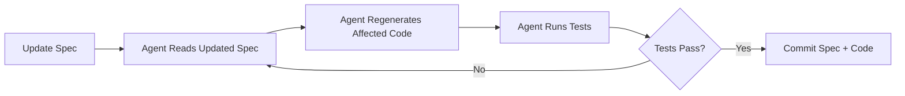

# Example Project: URL Shortener (Spec-Driven Development)

> Build a complete URL Shortener service on AWS — from spec documents to deployed infrastructure — using only agent conversations. No code written by hand.

---

## What Is Spec-Driven Development?

**Spec-driven development** is how leading engineering teams at AI-heavy companies build projects today. The core idea:

> **Specification documents are the source of truth. Code is generated *from* specs. When the spec changes, the code changes.**

```
Traditional:                    Spec-Driven:

Developer writes code    →     Developer writes SPECS
Developer writes tests   →     Agent generates code FROM specs
Developer writes docs    →     Agent generates tests FROM specs
                                Agent generates docs FROM specs
                                Specs live in version control
                                Code is a DERIVATIVE of specs
```

### Why Spec-Driven?

| Benefit | Explanation |
|---|---|
| **Reviewable** | PRs review spec changes (human-readable), not generated code |
| **Reproducible** | Same spec + same agent = same output. Regenerate any time. |
| **Language-agnostic** | Same spec can generate Go, Java, or TypeScript implementations |
| **AI-native** | Agents are *excellent* at implementing from specs — better than from vague prompts |
| **Team-scalable** | Junior devs write specs; agents generate code; seniors review specs |

### How Companies Are Doing It

The pattern emerging at AI-forward engineering teams:

1. **Product/Engineering** writes a spec (requirements, API contract, architecture)
2. **Spec goes into version control** alongside code
3. **Agent reads specs** via project config (AGENTS.md, skills, or MCP resources)
4. **Agent generates implementation** that conforms to the spec
5. **CI validates** generated code against the spec (contract tests, linting, type checks)
6. **Spec changes trigger regeneration** — code stays in sync

This is the natural evolution of design-docs-that-rot. Specs that *drive* code never go stale.

---

## The Spec Files

For our URL Shortener, we create **four spec documents** before any code:

```
examples/url-shortener/
└── specs/
    ├── requirements.md      → What we're building and why
    ├── api-spec.yaml        → OpenAPI contract
    ├── architecture.md      → System design and AWS resources
    └── data-model.md        → DynamoDB table design
```

These specs are what the agent reads to generate the entire project.

---

### Spec 1: Requirements (`specs/requirements.md`)

```markdown
# URL Shortener — Requirements Specification

## Overview
A serverless URL shortener for internal use by the marketing team.
Custom branded domain, click analytics, and API-first design.

## Functional Requirements

### FR-1: Create Short URL
- **Endpoint**: POST /shorten
- **Input**: Original URL (required), custom slug (optional)
- **Behavior**:
  - If custom slug provided and available → use it
  - If custom slug taken → return 409 Conflict
  - If no slug → generate random 7-character alphanumeric code
  - Validate URL format (must be valid HTTP/HTTPS URL)
- **Output**: Short URL, original URL, created timestamp, short code

### FR-2: Redirect
- **Endpoint**: GET /{code}
- **Behavior**:
  - Look up code in database
  - If found → 301 redirect to original URL
  - If not found → 404 Not Found
  - Record click event asynchronously (do not block redirect)

### FR-3: Click Analytics
- **Endpoint**: GET /{code}/stats
- **Output**: Total clicks, clicks per day (last 30 days), top referrers

## Non-Functional Requirements

| Requirement | Target |
|---|---|
| Redirect latency (P99) | < 50ms |
| Create latency (P99) | < 200ms |
| Availability | 99.9% |
| Max URL length | 2048 characters |
| Short code format | [a-zA-Z0-9]{7} |
| Analytics retention | 90 days |
| Rate limiting | 100 creates/min, 10K redirects/min |

## Out of Scope (V1)
- User authentication (internal tool, VPN-only)
- URL expiration / TTL
- QR code generation
- Bulk import
```

---

### Spec 2: API Contract (`specs/api-spec.yaml`)

```yaml
openapi: 3.0.3
info:
  title: URL Shortener API
  version: 1.0.0
  description: Internal URL shortener for marketing team

servers:
  - url: https://acme.co
    description: Production

paths:
  /shorten:
    post:
      operationId: createShortURL
      summary: Create a shortened URL
      requestBody:
        required: true
        content:
          application/json:
            schema:
              type: object
              required: [url]
              properties:
                url:
                  type: string
                  format: uri
                  maxLength: 2048
                  example: "https://www.example.com/very/long/path"
                slug:
                  type: string
                  pattern: "^[a-zA-Z0-9-]{3,30}$"
                  example: "spring-sale"
      responses:
        "201":
          description: Short URL created
          content:
            application/json:
              schema:
                $ref: "#/components/schemas/ShortURL"
        "400":
          description: Invalid input
          content:
            application/json:
              schema:
                $ref: "#/components/schemas/Error"
        "409":
          description: Slug already taken
          content:
            application/json:
              schema:
                $ref: "#/components/schemas/Error"

  /{code}:
    get:
      operationId: redirectToURL
      summary: Redirect to original URL
      parameters:
        - name: code
          in: path
          required: true
          schema:
            type: string
            pattern: "^[a-zA-Z0-9]{7}$|^[a-zA-Z0-9-]{3,30}$"
      responses:
        "301":
          description: Redirect to original URL
          headers:
            Location:
              schema:
                type: string
                format: uri
        "404":
          description: Short code not found
          content:
            application/json:
              schema:
                $ref: "#/components/schemas/Error"

  /{code}/stats:
    get:
      operationId: getURLStats
      summary: Get click analytics for a short URL
      parameters:
        - name: code
          in: path
          required: true
          schema:
            type: string
      responses:
        "200":
          description: Click analytics
          content:
            application/json:
              schema:
                $ref: "#/components/schemas/URLStats"
        "404":
          description: Short code not found

components:
  schemas:
    ShortURL:
      type: object
      properties:
        short_code:
          type: string
          example: "abc1234"
        short_url:
          type: string
          format: uri
          example: "https://acme.co/abc1234"
        original_url:
          type: string
          format: uri
        created_at:
          type: string
          format: date-time

    URLStats:
      type: object
      properties:
        short_code:
          type: string
        total_clicks:
          type: integer
        daily_clicks:
          type: array
          items:
            type: object
            properties:
              date:
                type: string
                format: date
              count:
                type: integer
        top_referrers:
          type: array
          items:
            type: object
            properties:
              referrer:
                type: string
              count:
                type: integer

    Error:
      type: object
      properties:
        error:
          type: string
        message:
          type: string
```

---

### Spec 3: Architecture (`specs/architecture.md`)

```markdown
# URL Shortener — Architecture Specification

## System Diagram

```mermaid
graph TB
    Client[Browser / API Client]
    
    subgraph AWS
        APIGW[API Gateway HTTP API<br/>Custom Domain: acme.co]
        
        subgraph "Compute (Lambda)"
            Create[CreateURL<br/>Go 1.22 | 128MB | 10s]
            Resolve[ResolveURL<br/>Go 1.22 | 128MB | 5s]
            Stats[GetStats<br/>Go 1.22 | 128MB | 10s]
        end
        
        subgraph "Storage (DynamoDB)"
            URLTable[(urls<br/>PK: short_code)]
            ClickTable[(clicks<br/>PK: short_code<br/>SK: timestamp)]
        end
        
        CW[CloudWatch<br/>Logs + Metrics + Alarms]
    end
    
    Client -->|POST /shorten| APIGW
    Client -->|GET /:code| APIGW
    Client -->|GET /:code/stats| APIGW
    APIGW --> Create
    APIGW --> Resolve
    APIGW --> Stats
    Create -->|PutItem| URLTable
    Resolve -->|GetItem| URLTable
    Resolve -->|PutItem| ClickTable
    Stats -->|Query| ClickTable
    Create --> CW
    Resolve --> CW
    Stats --> CW
```

## AWS Resources

| Resource | Service | Config | Estimated Cost |
|---|---|---|---|
| API | API Gateway v2 (HTTP) | Custom domain, CORS | ~$1/mo |
| CreateURL | Lambda | Go, 128MB, 10s timeout | ~$0.20/mo |
| ResolveURL | Lambda | Go, 128MB, 5s timeout | ~$0.30/mo |
| GetStats | Lambda | Go, 128MB, 10s timeout | ~$0.05/mo |
| URLs table | DynamoDB | On-demand, PK: short_code | ~$0.50/mo |
| Clicks table | DynamoDB | On-demand, TTL: 90 days | ~$1.00/mo |
| TLS cert | ACM | Auto-renewed | Free |
| DNS | Route 53 | Hosted zone | $0.50/mo |
| **Total** | | | **~$3.55/mo** |

## Design Decisions

1. **HTTP API over REST API**: 60% cheaper, lower latency, sufficient for our needs
2. **Separate Lambda per endpoint**: Independent scaling, isolated failures, clear metrics
3. **DynamoDB on-demand**: Unpredictable traffic, <$5/mo at our scale
4. **Click recording in same request**: Acceptable latency trade-off for V1 simplicity
5. **No caching layer**: DynamoDB single-digit-ms reads are sufficient for 100K/day
```

---

### Spec 4: Data Model (`specs/data-model.md`)

```markdown
# URL Shortener — Data Model Specification

## Table: urls

| Attribute | Type | Key | Description |
|---|---|---|---|
| `short_code` | String | Partition Key | The unique short code (e.g., "abc1234") |
| `original_url` | String | — | The destination URL |
| `created_at` | String (ISO 8601) | — | Creation timestamp |
| `created_by` | String | — | Creator identifier (IP or future user ID) |
| `click_count` | Number | — | Atomic counter for total clicks |

### Access Patterns
| Pattern | Operation | Key Condition |
|---|---|---|
| Get URL by code | GetItem | PK = short_code |
| Create URL | PutItem | PK = short_code (ConditionExpression: attribute_not_exists) |
| Increment clicks | UpdateItem | PK = short_code (SET click_count = click_count + 1) |

## Table: clicks

| Attribute | Type | Key | Description |
|---|---|---|---|
| `short_code` | String | Partition Key | Which short URL was clicked |
| `timestamp` | String (ISO 8601) | Sort Key | When the click happened |
| `referrer` | String | — | HTTP Referer header |
| `user_agent` | String | — | Client user agent |
| `ip_country` | String | — | Geo from IP (if available) |
| `ttl` | Number | — | DynamoDB TTL (90 days from creation) |

### Access Patterns
| Pattern | Operation | Key Condition |
|---|---|---|
| Record click | PutItem | PK = short_code, SK = timestamp |
| Get clicks for URL (date range) | Query | PK = short_code, SK between start and end |
| Auto-delete old clicks | TTL | DynamoDB automatic deletion |
```

---

## The Agent Conversation: Building From Specs

Here's how a real agent session looks when building from these specs. Each phase shows the **exact prompt** you give and what the agent produces.

### Phase 1: Initialize Project

**Your prompt:**
```
Initialize a Go project for a URL shortener.
Read the specs in specs/ for full requirements.
Follow the golang skill in .agent/skills/golang/.
Create the project layout with cmd/, internal/, and terraform/ directories.
```

**Agent produces:**
```
examples/url-shortener/
├── go.mod
├── go.sum
├── cmd/
│   └── api/
│       └── main.go
├── internal/
│   └── shortener/
│       ├── handler.go
│       ├── handler_test.go
│       ├── model.go
│       └── store.go
└── ...
```

### Phase 2: Generate Infrastructure

**Your prompt:**
```
Generate Terraform infrastructure based on specs/architecture.md and 
specs/data-model.md. Follow the terraform skill in .agent/skills/terraform/.
Use the AWS naming convention from .agent/skills/aws/.
```

**Agent produces:**
```
terraform/
├── main.tf           → Lambda functions, API Gateway, DynamoDB tables
├── variables.tf      → Environment, project name, domain
├── outputs.tf        → API URL, function ARNs
├── providers.tf      → AWS provider with version constraints
├── iam.tf            → Lambda execution roles (least privilege)
└── api_gateway.tf    → HTTP API with routes and integrations
```

### Phase 3: Generate Application Code

**Your prompt:**
```
Implement the Lambda handlers based on specs/api-spec.yaml and 
specs/data-model.md. Each endpoint should be in its own handler function.
Follow specs/requirements.md for business rules (slug validation, 
URL format validation, error codes).
```

**Agent produces:**
- `internal/shortener/handler.go` — HTTP handler with create, redirect, stats
- `internal/shortener/model.go` — Domain types matching the data model spec
- `internal/shortener/store.go` — DynamoDB client matching access patterns from spec
- `cmd/api/main.go` — Lambda entry point with dependency wiring

### Phase 4: Generate Tests

**Your prompt:**
```
Write tests for all handlers based on specs/api-spec.yaml.
Cover every response code in the spec:
- 201 Created (valid URL, with and without custom slug)
- 400 Bad Request (invalid URL, invalid slug format)
- 409 Conflict (duplicate slug)
- 301 Redirect (valid code)
- 404 Not Found (unknown code)
- 200 OK (stats endpoint)

Use table-driven tests per the golang skill.
```

**Agent produces:**
- `internal/shortener/handler_test.go` — comprehensive table-driven tests covering every spec scenario

### Phase 5: Validate & Deploy

**Your prompt:**
```
Run the test workflow: /test
Then run the deploy workflow: /deploy
```

**Agent follows workflows:**
1. `go test -v -cover ./...` → all tests pass
2. `go test -race ./...` → no race conditions
3. `GOOS=linux GOARCH=amd64 go build -o bootstrap cmd/api/main.go`
4. `cd terraform && terraform plan` → review
5. `cd terraform && terraform apply`

---

## The Spec-Driven Feedback Loop

When requirements change, you update the **spec**, not the code:



### Example: Adding URL Expiration

1. **Update `specs/requirements.md`**:
   ```diff
   + ### FR-4: URL Expiration
   + - URLs can have an optional TTL (time-to-live)
   + - Default TTL: none (permanent)
   + - Expired URLs return 410 Gone
   ```

2. **Update `specs/api-spec.yaml`**:
   ```diff
     properties:
       url:
         type: string
   +   expires_in:
   +     type: integer
   +     description: "TTL in seconds (optional)"
   ```

3. **Update `specs/data-model.md`**:
   ```diff
   + | `expires_at` | Number | — | DynamoDB TTL for URL expiration |
   ```

4. **Tell the agent**:
   ```
   I've updated the specs to add URL expiration (FR-4).
   Read the updated specs and modify the implementation to match.
   Add tests for the new 410 Gone response.
   ```

The agent reads the diffs, updates the handler, model, store, Terraform DynamoDB config, and tests — all from the spec changes.

---

## Project Directory (Complete)

```
examples/url-shortener/
├── .agent/
│   ├── workflows/
│   │   ├── test.md
│   │   └── deploy.md
│   └── skills/
│       ├── golang/SKILL.md
│       ├── terraform/SKILL.md
│       └── aws/SKILL.md
├── .mcp/
│   └── mcp.json
├── AGENTS.md
├── CLAUDE.md
│
├── specs/                          ← SOURCE OF TRUTH
│   ├── requirements.md
│   ├── api-spec.yaml
│   ├── architecture.md
│   └── data-model.md
│
├── cmd/                            ← GENERATED FROM SPECS
│   └── api/
│       └── main.go
├── internal/                       ← GENERATED FROM SPECS
│   └── shortener/
│       ├── handler.go
│       ├── handler_test.go
│       ├── model.go
│       └── store.go
├── terraform/                      ← GENERATED FROM SPECS
│   ├── main.tf
│   ├── variables.tf
│   ├── outputs.tf
│   ├── providers.tf
│   ├── iam.tf
│   └── api_gateway.tf
│
├── go.mod
└── README.md
```

Notice the clear separation: **`specs/` is what humans write and review**, everything else is derived.

---

## Key Takeaways

1. **Specs are code** — They live in version control, get reviewed in PRs, and drive implementation
2. **Agents are spec interpreters** — They read your specs and produce conforming code
3. **Change the spec, not the code** — When requirements change, update specs first
4. **Skills encode conventions** — Team standards are captured once, applied everywhere
5. **Workflows automate sequences** — Build, test, deploy are repeatable one-command operations
6. **MCP extends reach** — Connect to GitHub, databases, cloud APIs through standard protocol

This is the emerging model: **developers as architects and spec writers, agents as implementers**. The code is a derivative artifact. The spec is the product.

---

**Previous**: [← Skills Catalog](04-skills-catalog.md) | **Back to**: [README](../README.md)
