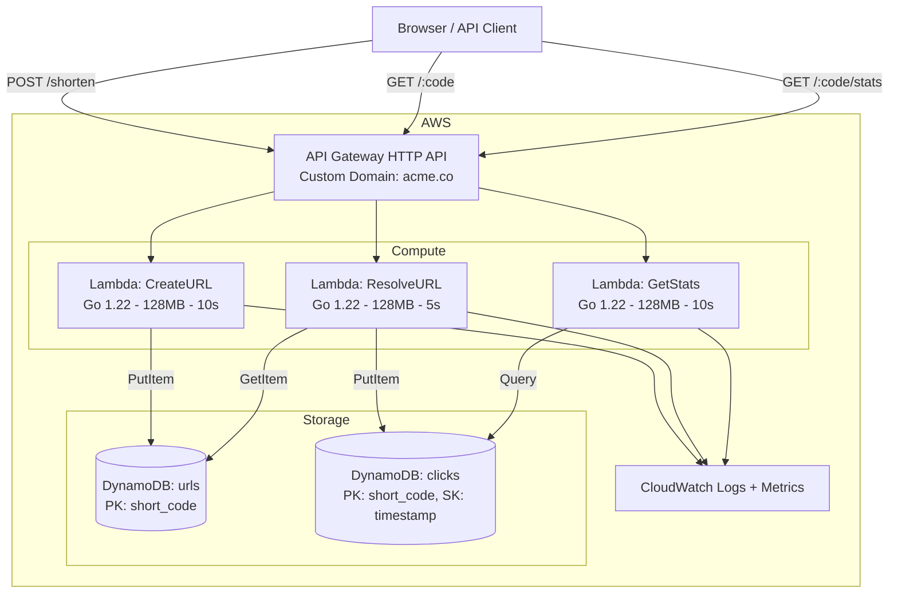

# URL Shortener — Architecture Specification

## System Diagram

## AWS Resources

| Resource | Service | Config | Est. Monthly Cost |
|---|---|---|---|
| API | API Gateway v2 (HTTP) | Custom domain, CORS | ~$1.00 |
| CreateURL | Lambda | Go, 128MB, 10s timeout | ~$0.20 |
| ResolveURL | Lambda | Go, 128MB, 5s timeout | ~$0.30 |
| GetStats | Lambda | Go, 128MB, 10s timeout | ~$0.05 |
| urls table | DynamoDB | On-demand, PK: short_code | ~$0.50 |
| clicks table | DynamoDB | On-demand, TTL: 90 days | ~$1.00 |
| TLS cert | ACM | Auto-renewed | Free |
| DNS | Route 53 | Hosted zone | $0.50 |
| **Total** | | | **~$3.55** |

## Design Decisions

1. **HTTP API over REST API** — 60% cheaper, lower latency, sufficient for our needs
2. **Separate Lambda per endpoint** — Independent scaling, isolated failures, clear metrics
3. **DynamoDB on-demand** — Unpredictable traffic, <$5/mo at our scale
4. **Click recording in same request** — Acceptable latency trade-off for V1 simplicity
5. **No caching layer** — DynamoDB single-digit-ms reads sufficient for 100K/day
